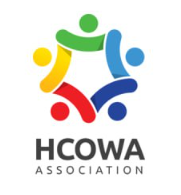

<p align="center">
  
</p>

<h1 align="center">HCOWA 每日热点新闻生成器</h1>
<p align="center">Health Community of West Africa</p>
<p align="center">西非健康共同体协会 · 智能简报系统</p>
<p align="center">作者：张翟 Zaki</p>

<h3 align="center">
  中文 | <a href="https://github.com/cshaizhihao/hcowa-brief-automation/blob/master/readmeenglish.md">ENGLISH</a>
</h3>

<p align="center">
  
  
  
</p>

---

## ✨ 功能特性

| 功能 | 说明 |
|------|------|
| 🔄 一键同步热点 | 自动检索当日西非地区医疗健康新闻 |
| 📰 智能中文处理 | 全程自动将英文内容转换为中文 |
| 📅 往期回顾 | 支持按日期查询历史新闻（不可选未来日期）|
| 📋 一键复制 | 生成后直接复制，粘贴即可发布 |
| 📝 HCOWA 简评 | 每条新闻配备专业分析简评 |
| 🎨 Win11 风格 UI | 现代化界面，简洁高效 |
| 🌐 中文-英文切换 | 方便非洲同事与国内同事使用 |
| 📝 新闻公众号扩写 | 一键打开豆包粘贴后扩写为公众号 |

---

## 🚀 快速开始（推荐）

无需安装 Python 或任何依赖，双击即用：

1. 前往 [Releases 页面](https://github.com/cshaizhihao/hcowa-brief-automation/releases) 下载最新版本
2. 下载 `HCOWA_Brief_Helper.exe`
3. 双击运行即可

## > 如 Windows Defender 提示"未知发布者"，点击「更多信息」→「仍要运行」即可。这是未签名的开源程序的正常提示。
## > 国内使用请务必打开代理软件！！！不然谷歌翻译无法使用会导致翻译错误！

---

## 📖 使用教程

### 第一步：选择日期

程序启动后，顶部显示今日日期（默认）。

- 今日简报：保持默认，直接进行第二步。
- 往期回顾：点击日期框，通过弹出日历选择历史日期（系统已锁定，无法选择未来日期）。

### 第二步：同步热点新闻

点击 「🔄 同步今日热点新闻」 按钮。

程序将自动：
1. 检索西非医疗健康领域最新动态
2. 提取各新闻标题、摘要及原文链接
3. 将内容转换为中文
4. 按照 HCOWA 标准简报格式排版输出

*同步过程约需 10-30 秒，取决于网络状况。*

### 第三步：校对与复制

内容生成后，你可以在文本框中直接编辑修改任何细节。

确认无误后，点击 「📋 复制简报全文」，内容将直接进入剪贴板，粘贴到 Telegram、微信或文档中即可发布。

### 第四步：可选扩写为公众号

内容生成后，则可解锁绿色按钮📝扩写为公众号。

点击 「📝扩写为公众号」，根据要求选择具体新闻内容，点击确定后自动跳转豆包AI网页版本，在下方按Ctrl+V直接发送，无需登录。

---

## 🛠️ 开发者指南

如需从源码运行或二次开发：

```bash
# 克隆仓库
git clone https://github.com/cshaizhihao/hcowa-brief-automation.git
cd hcowa-brief-automation

# 安装依赖
pip install -r requirements.txt

# 运行程序
python main.py

# 自行打包（Windows）
pip install pyinstaller
pyinstaller --noconsole --onefile --add-data "assets;assets" --icon "assets/icon.ico" --name HCOWA_Brief_Helper main.py
```

### 项目结构

```
hcowa-brief-automation/
├── main.py                  # 主程序
├── requirements.txt         # Python 依赖
├── assets/
│   ├── logo.jpg             # HCOWA 品牌图标
│   └── icon.ico             # 程序图标（编译时生成）
└── .github/
    └── workflows/
        └── build.yml        # GitHub Actions 自动打包配置
```

---

## 📋 简报格式说明

生成的简报严格遵循 HCOWA 标准格式：

```
《HCOWA西非健康共同体协会每日健康时事简报》
日期：YYYY年MM月DD日 | 坐标：加纳 · 阿克拉 (Accra)
───
📌 【首要关注：】
1. [新闻标题（中文）]
• 概况：[新闻摘要（中文）]
• HCOWA 简评：[专业分析]
• 来源：[原文链接]

───
🌍 【西非区域动态汇报】
...
📊 【西非医疗板块股市动态】
...
📋 【HCOWA 建议】
...
───
[展会招商信息]
[HCOWA 信息中心]
```

---

<p align="right"><sub>Powered by HCOWA Information Center · Designed by Zaki</sub></p>
