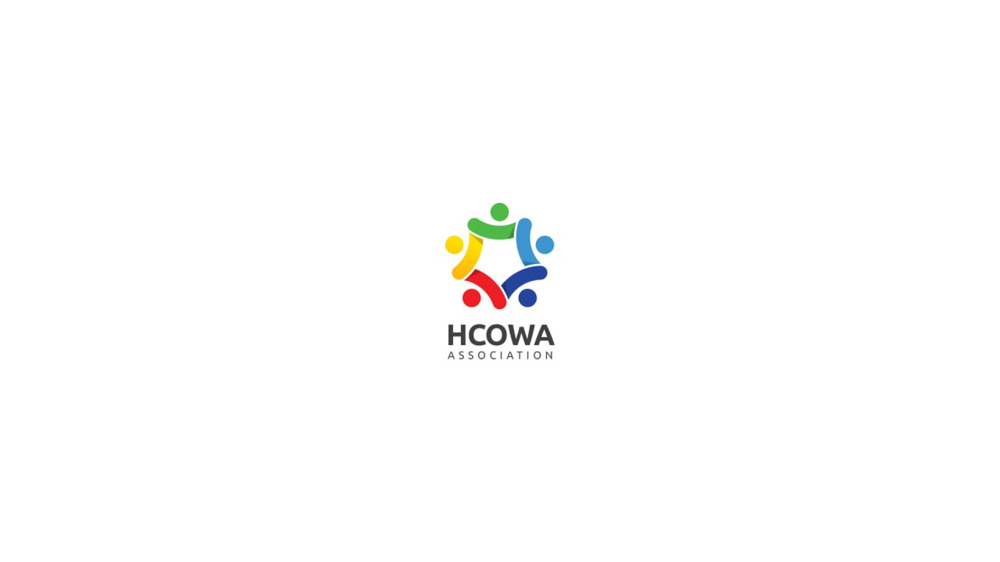

<p align="center">
  
</p>

<h1 align="center">HCOWA Daily News Generator</h1>
<p align="center">West Africa Health Community Association · Smart Brief System</p>
<p align="center">Author: Zaki</p>
<p align="center">
  
  
  
</p>

---

## ✨ Features

| Feature | Description |
|------|------|
| 🔄 One-Click Sync | Automatically retrieves daily medical and health news in West Africa |
| 📰 Smart Translation | Automatically translates English content into Chinese |
| 📅 Past Review | Supports querying historical news by date (future dates disabled) |
| 📋 One-Click Copy | Copy directly after generation, paste to publish |
| 📝 HCOWA Comments | Provides professional analysis and brief comments for each news item |
| 🎨 Win11 Style UI | Modern, clean, and efficient interface |
| 🌐 CN-EN Toggle | Convenient for both African and Chinese colleagues |
| 📝 Expand to Article | One-click jump to Doubao AI, paste to expand into a WeChat Official Account article |

---

## 🚀 Quick Start (Recommended)

No Python or dependencies required. Just double-click to run:

1. Go to the [Releases page](https://github.com/cshaizhihao/hcowa-brief-automation/releases) to download the latest version.
2. Download `HCOWA_Brief_Helper.exe`.
3. Double-click to run.

> If Windows Defender prompts "Unknown Publisher", click "More info" → "Run anyway". This is a normal prompt for unsigned open-source programs.

---

## 📖 Usage Guide

### Step 1: Select Date

Upon startup, the program displays today's date at the top by default.

- **Today's Briefing:** Keep the default and proceed directly to Step 2.
- **Past Review:** Click the **"Brief Date:"** box and select a historical date from the pop-up calendar (the system is locked and cannot select future dates).

### Step 2: Sync Hot News

Click the **"🔄 Sync Today's News"** button.

The program will automatically:
1. Retrieve the latest updates in the West African medical and health sector.
2. Extract news titles, summaries, and original links.
3. Translate the content into Chinese.
4. Format the output according to the standard HCOWA briefing layout.

*The synchronization process takes about 10-30 seconds, depending on network conditions.*

### Step 3: Proofread & Copy

After generation, you can directly edit and modify any details in the text box.

Once confirmed, click **"📋 Copy Full Brief"**, and the content will be directly copied to your clipboard. Paste it into Telegram, WeChat, or a document to publish.

### Step 4: Optional Expansion for Official Account

Once the content is generated, the green button will be unlocked.

Click **"📝 Expand to Article"**, select the specific news content as prompted, click confirm, and it will automatically redirect to the Doubao AI web version. Press `Ctrl+V` at the bottom to send directly without logging in.

---

## 🛠️ Developer Guide

For running from source code or secondary development:

```bash
# Clone the repository
git clone [https://github.com/cshaizhihao/hcowa-brief-automation.git](https://github.com/cshaizhihao/hcowa-brief-automation.git)
cd hcowa-brief-automation

# Install dependencies
pip install -r requirements.txt

# Run the program
python main.py

# Package manually (Windows)
pip install pyinstaller
pyinstaller --noconsole --onefile --add-data "assets;assets" --icon "assets/icon.ico" --name HCOWA_Brief_Helper main.py


### Project Structure

```
hcowa-brief-automation/
├── main.py                  # Main program
├── requirements.txt         # Python dependencies
├── assets/
│   ├── logo.png             # HCOWA brand icon
│   └── icon.ico             # Program icon (generated during compilation)
└── .github/
    └── workflows/
        └── build.yml        # GitHub Actions automated build configuration
```

```

📋 Briefing Format Specification

The generated briefing strictly follows the standard HCOWA format:

```
《HCOWA西非健康共同体协会每日健康时事简报》
Date: YYYY-MM-DD | Location: Accra, Ghana
───
📌 [Top Focus:]
1. [News Title (Chinese)]
• Overview: [News Summary (Chinese)]
• HCOWA Comment: [Professional Analysis]
• Source: [Original Link]

───
🌍 [West Africa Regional Dynamics Report]
...
📊 [West Africa Medical Sector Stock Market Dynamics]
...
📋 [HCOWA Recommendations]
...
───
[Exhibition & Investment Information]
[HCOWA Information Center]
```

---

<p align="right"><sub>Powered by HCOWA Information Center · Designed by Zaki</sub></p>
